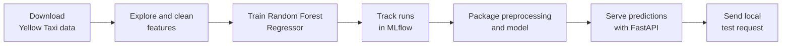

# Model Deployment Project

Use this repository as a **template** for your model deployment project. You will train a regression model that predicts the duration of NYC Yellow Taxi trips, track your experiments locally with MLflow, and serve predictions through a FastAPI app on your own machine. Create pull requests in your own copy even if you are working alone, and use them to track your progress.

## Learning Objectives

By the end of this repository, you should be able to:

- Build an end-to-end regression workflow for real-world taxi trip data.
- Separate exploration, preprocessing, training, and serving concerns into maintainable code.
- Track experiments locally with MLflow and compare model runs.
- Serve model predictions through a local API.

## Learning Path



| File / Folder | Description |
|---|---|
| [**Project Description**](project-description.md) | The assignment tasks, suggested workflow, repository layout, and stretch goals. |

### Additional Folders and Files

| File / Folder | Description |
|---|---|
| [**pyproject.toml**](pyproject.toml) | Project configuration and dependencies. |
| [**uv.lock**](uv.lock) | Dependency lock file. |

## Setup

> [!NOTE]
> Throughout these steps, text in angle brackets like `<repo-name>` is a **placeholder**. Replace it, including the `< >` brackets, with your own value. For example, `cd <repo-name>` becomes `cd mle-model-deployment-project`.

### 1. Create the Repository from the Template

Click **Use this template** on GitHub.

When creating the repository:

- Set yourself as the **Owner**
- Choose a repository name
- Disable **Include all branches**
- Click **Create repository**

> [!IMPORTANT]
> If you are working in pairs or groups, only **one person** should complete this step.

---

### 2. Add Collaborators (Pairs/Groups Only)

If working with teammates:

1. Open the repository on GitHub
2. Go to **Settings → Collaborators**
3. Add your teammates as collaborators
4. Share the repository link with your team

Teammates should accept the invitation before continuing.

---

### 3. Clone the Repository

Copy the SSH URL from the **Code** button on GitHub, then run:

```bash
git clone <copied-ssh-url>
```

The copied SSH URL will look like `git@github.com:<your-username>/<repo-name>.git`.

---

### 4. Move into the Project Folder and Install Dependencies

This installs all dependencies and creates a virtual environment in `.venv/`.

```bash
cd <repo-name>
uv sync
```

---

### 5. Open the Repository in VS Code

> [!NOTE]
> Make sure you open VS Code from the project root so it automatically detects the environment created by `uv sync`.

Launch VS Code in the project root folder:

```bash
code .
```

If you create a notebook to explore the data, select the Python environment created by `uv sync` as the kernel.

## How to Use This Repo

The starter implementation is in place. Begin with [notebook.ipynb](notebook.ipynb), which walks through downloading and inspecting the data, cleaning trips, training, tracking, and testing the API. The first test cell uses small synthetic data and does not download the taxi dataset.

Reusable code is split by responsibility:

- `src/pipeline.py` validates and prepares trips and builds the preprocessing-plus-model pipeline.
- `src/train.py` splits data, trains the baseline, records the RMSE and parameters in MLflow, and saves the model.
- `app/main.py` validates prediction requests and serves the saved model.
- `tests/test_pipeline.py` contains fast checks for cleaning, model fitting, and API behavior.

The downloaded raw file is stored under `data/` and ignored by Git because it is large.

Run the tests from the project root:

```powershell
uv run pytest tests/test_pipeline.py -q
```

### Working Locally

After running the notebook training cells, the fitted model is saved to `artifacts/taxi_duration_pipeline.joblib`, and MLflow runs are stored locally in the SQLite database at `mlruns/mlflow.db`.

1. Start the tracking UI:

   ```bash
   uv run mlflow ui --backend-store-uri ./mlruns/mlflow.db --port 5000
   ```

2. In another terminal, run the API locally:

   ```bash
   uv run uvicorn app.main:app --reload --port 8000
   ```

3. Open `http://127.0.0.1:8000/docs` to send a request, or use PowerShell:

   ```powershell
   $body = @{
       trip_distance = 2.5
       passenger_count = 1
       pickup_hour = 9
       pickup_weekday = 2
       PULocationID = 161
       DOLocationID = 236
   } | ConvertTo-Json

   Invoke-RestMethod -Uri "http://127.0.0.1:8000/predict" -Method Post -ContentType "application/json" -Body $body
   ```

The response contains the predicted trip duration in minutes. Record your measured validation RMSE and discuss data-cleaning choices and limitations after running the real-data training cells.
